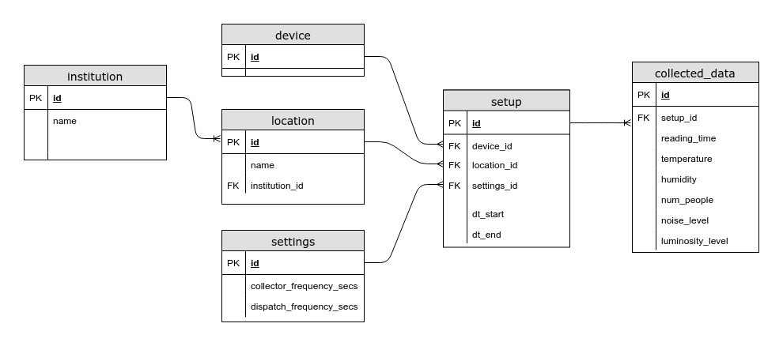

# Relatório - Banco de Dados

### Análise do banco de dados atual

O banco de dados atual é composto por uma única tabela com as seguintes colunas: 
`reading_time, temperature, humidity, count,sound, luminosity`.

Inicialmente, propõe-se o desmembramento e generalização do modelo, 
para que a solução possa a ser aplicada em novas localidades.

### Modelagem Proposta

### Módulos Afetados

1. Coleta
1. Integração: `BD -> Módulo de Aprendizagem`
1. Visualização:
    1. *Necessário adaptar para múltiplas localidades / dispositivos*